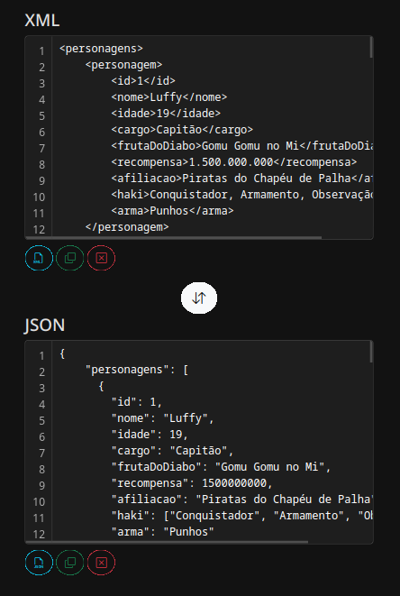

## Conversor XML ⇄ JSON

# Conversor JSON ⇄ XML

Esta é uma aplicação web simples que permite converter entre os formatos JSON e XML. Ela oferece uma interface interativa para entrada de dados em XML ou JSON, com funcionalidades adicionais como copiar, limpar e carregar exemplos pré-definidos.

## Funcionalidades

- **Conversão XML ⇄ JSON**: Permite converter XML para JSON diretamente na interface.
- **Exemplos de XML e JSON**: Carregue exemplos de arquivos JSON e XML para testar a conversão.
- **Copiar dados**: Copie o conteúdo dos campos de entrada de XML ou JSON com um clique.
- **Limpar campos**: Limpe facilmente os campos de entrada de JSON ou XML.
- **Visualização com números de linha**: Interface visual de edição com números de linha para facilitar a leitura.

## Como Usar

1. Abra a página no navegador.
2. Digite ou cole seu **XML** no **XML Console** ou seu **JSON** no **JSON Console**.
3. Use o botão **XML > JSON** para converter o XML em JSON.
4. Clique em **Exemplo XML** ou **Exemplo JSON** para carregar dados de exemplo nos respectivos campos.
5. Clique em **Copiar XML** ou **Copiar JSON** para copiar o conteúdo dos campos de texto.
6. Use o botão **Limpar** para limpar o conteúdo dos consoles de XML ou JSON.

